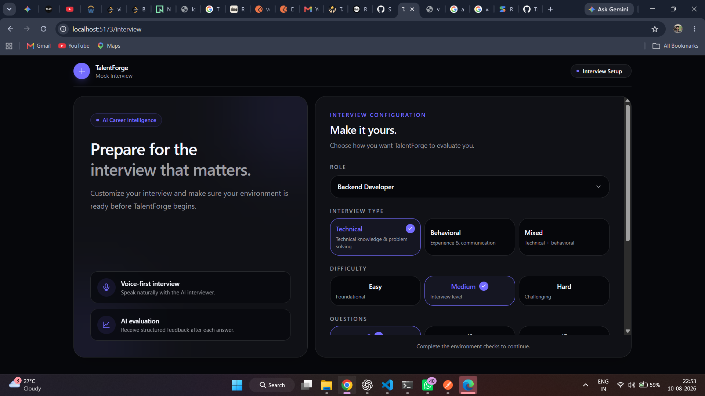
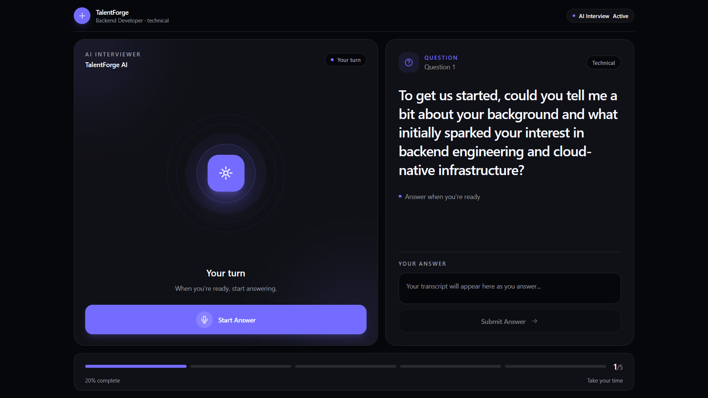

# TalentForge — Voice-First AI Mock Interviewer

> A voice-first AI mock interview system built for **StarForge 2026 (VoxForge track)**. TalentForge combines Rime speech, resume-grounded Qdrant retrieval, and AI-driven evaluation to simulate a real technical interview — not a chatbot with a microphone.

---

## The Problem

Most interview prep tools are text-based question banks. A real interview requires listening under pressure, thinking while speaking, and reacting to follow-ups — none of which a typed chatbot reproduces. TalentForge makes voice the primary interaction: the candidate hears a question, answers out loud, and gets evaluated on both technical substance and communication.

## Why Voice Is Essential

```text
Candidate → Speech Recognition → Interview Engine → Qdrant (resume context) + Gemini (question / evaluation) → Rime TTS → Spoken Response → Candidate
```

The candidate never reads or types the interview — they speak and listen through the entire loop, including recovering from interruptions.

---

## How It Works

1. **Configure** — candidate picks role, interview type, difficulty, and question count.
2. **Blueprint-driven stage** — a deterministic interview blueprint decides question type, difficulty, and whether resume context is needed; the AI model only generates the wording.
3. **Resume retrieval** — when required, Qdrant returns semantically relevant resume context (projects, skills, experience).
4. **Question generation** — Gemini generates one question grounded in the blueprint + retrieved context.
5. **Voice delivery** — the question is sent to Rime, converted to audio, and played in the browser.
6. **Candidate answers** — browser speech recognition transcribes the spoken response.
7. **Evaluation** — the answer is scored (technical, depth, communication) with strengths/weaknesses/feedback.
8. **Next question** — the engine advances the blueprint and repeats until the interview ends.

---

## Architecture

```text
Candidate ─▶ Browser Speech Recognition ─▶ Interview Engine (Backend)
                                                 │
                        ┌────────────────────────┼────────────────────────┐
                        ▼                        ▼                        ▼
                     Qdrant                   Gemini                 PostgreSQL
                (resume retrieval)     (question gen / eval)        (interview data)
                        └────────────┬───────────┘
                                     ▼
                              Generated Question
                                     ▼
                                 Rime TTS
                                     ▼
                            Spoken Question ─▶ Candidate
```

---

## Rime Integration (Voice)

Speech generation runs through Rime's TTS API and is essential to the main flow — every interview question is delivered as audio, not text.

**Endpoint:** `POST https://users.rime.ai/v1/rime-tts`
**Transport:** Backend-only REST call (API key never reaches the client)

```js
headers: {
  Authorization: `Bearer ${config.rime.apiKey}`,
  "Content-Type": "application/json",
  Accept: "audio/webm;codecs=opus",
}

body: {
  text: text.trim(),
  modelId: config.rime.model,     // configured via env
  speaker: config.rime.speaker,   // configured via env
  lang: "en",
  samplingRate: 24000,
}
```

- Model and speaker are environment-configured (`RIME_MODEL`, `RIME_SPEAKER`) rather than hardcoded, so the voice can be swapped per deployment.
- Response is streamed back as an Opus/WebM audio buffer and played directly in the browser.
- Failures are caught and surfaced as a `502 AppError` ("Voice generation failed") rather than silently breaking the interview.
- Duration and payload size are logged on every call for latency tracking.

Implementation: `server/src/service/interview/rimeService.js`

## Qdrant Integration (Meaningful Role)

Qdrant is not decorative — it directly changes what question gets asked and how an answer is judged.

| Use | Effect |
|---|---|
| Resume retrieval | Semantic search over the candidate's resume surfaces relevant projects/skills for the current stage |
| Question grounding | Retrieved context is injected into the Gemini prompt, producing candidate-specific questions instead of generic ones |
| Evaluation grounding | The same context is reused when scoring the answer, so feedback is tied to what the candidate actually built |

## Voice Interruption Handling

Each spoken response is tagged with a unique speech-operation ID. If the candidate starts talking while the AI is still speaking, the current operation is invalidated and audio stops immediately — preventing stale Rime audio from playing over the candidate.

## Latency Instrumentation

Backend and frontend both log timing for: STT first-result, Qdrant retrieval, Gemini generation/evaluation, Rime TTS, backend processing, and time-to-first-playback. Final numbers are produced from real interview runs (see repo for reproduction steps).

---

## Technology Stack

**Frontend:** React, Vite, Tailwind CSS, React Router, Axios, TanStack Query, React Hook Form, Zod
**Backend:** Node.js, Express, PostgreSQL, JWT, Google OAuth
**AI:** Google Gemini, Gemini Embeddings, LangChain, Qdrant
**Voice:** Browser Speech Recognition, Rime TTS
**Infra:** Railway, Neon PostgreSQL, Qdrant Cloud, Docker, GitHub Actions

---

## Project Structure

```text
talentforge/
├── client/    # React frontend
├── server/    # Express backend (interview engine, Rime + Qdrant services)
├── docs/      # architecture, latency, screenshots
└── docker-compose.yml
```

## Getting Started

```bash
git clone <YOUR_GITHUB_REPOSITORY_URL>
cd talentforge

# Backend
cd server && npm install
cp .env.example .env   # configure DATABASE_URL, GEMINI_API_KEY, QDRANT_URL, RIME keys, etc.
npm run dev

# Frontend (new terminal)
cd client && npm install
npm run dev
```

Required env vars (see `server/.env.example`): `DATABASE_URL`, `JWT_SECRET`, `GEMINI_API_KEY`, `GEMINI_CHAT_MODEL`, `GEMINI_EMBEDDING_MODEL`, `GOOGLE_CLIENT_ID`, `FRONTEND_URL`, `QDRANT_URL`, `QDRANT_API_KEY`, `RIME_API_KEY`, `RIME_MODEL`, `RIME_SPEAKER`.

Never commit API keys, DB credentials, or production `.env` files.

---

## Limitations

- Browser speech recognition varies across browsers/environments.
- Voice latency depends on network conditions and external service availability.
- AI evaluation is automated and not equivalent to a human interviewer's judgment.
- Currently scoped to technical interviews only.

## Screenshots

**Interview Configuration** — candidate sets role, interview type, and difficulty before TalentForge begins.



**Live Voice Interview** — the AI interviewer asks the question aloud while the candidate's turn and transcript are tracked in real time.



## Demo

- **Full demo:** link to be added after final recording
- **20–30s showcase clip:** link to be added after final recording

## Team Contributions

**Vikas Verma** — product architecture, backend development, AI orchestration, interview blueprint design, Qdrant integration, Rime integration, voice interruption handling, latency instrumentation.

**Aditya Pandey** — frontend development, voice UI/UX, speech recognition integration, interview flow screens, testing, deployment.

## AI-Assisted Development

AI coding assistants were used for debugging, implementation help, refactoring, and documentation. Architecture decisions, integration, and validation were done by the developer, who can explain the implementation and design choices behind the demo.

## Future Work

- Deeper interruption/barge-in handling
- Persistent cross-session candidate memory with retention/correction rules
- Multilingual interviews
- Adaptive difficulty based on live performance
- Reusable evaluation/regression tooling for the voice pipeline

---

*Built for StarForge 2026 — VoxForge track.*
